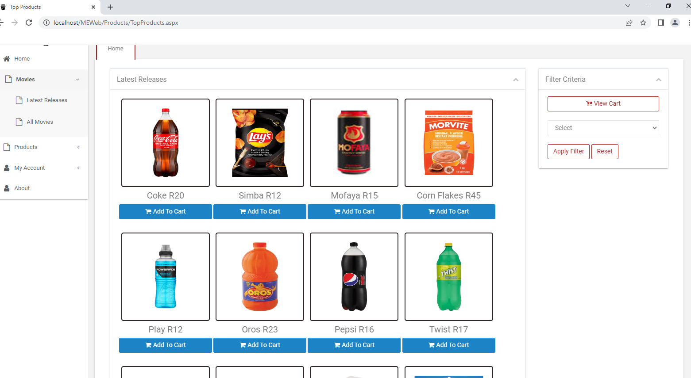
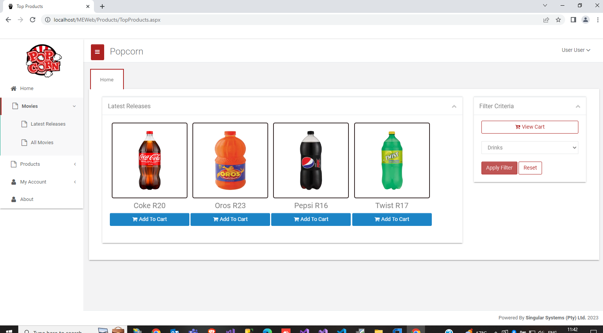
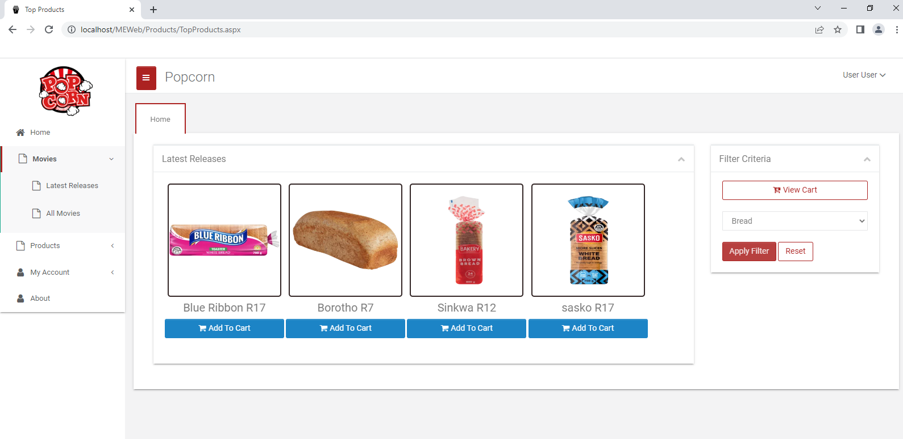
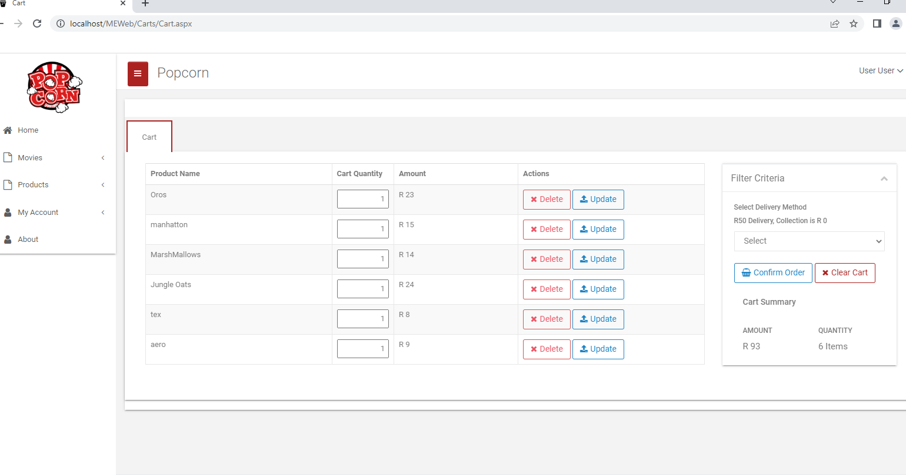
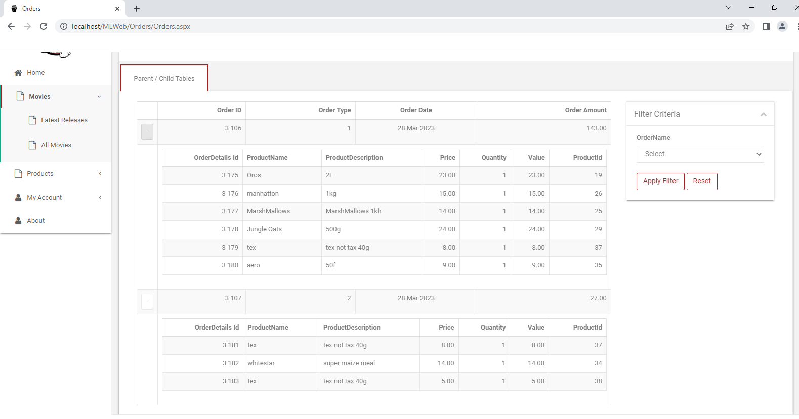
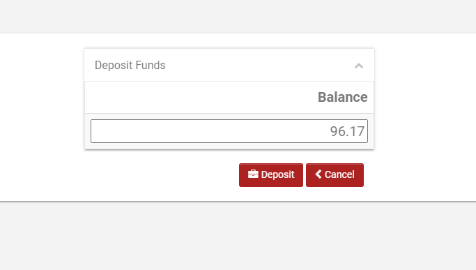
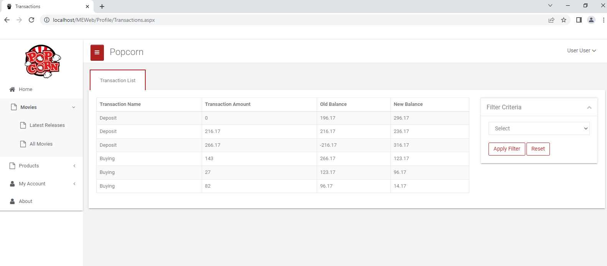

# MovieExpress

Application Requirements Overview Each person will register on the platform and fund their account in order to purchase items from the kiosk.

Owner/Administrator (Super User) a) The owner purchases products from various suppliers and records the information in the application using a maintenance screen. b) The owner would also be required to mark some products as not available and these should not be displayed in the application. (The supplier information and different prices from various suppliers does not have to be saved in the application.) c) Your administrator user should have the same functionality as a normal user, i.e. purchase items.

Users a) When a user logs into the system for the first time they should have the option to fund their account. b) The balance should be displayed and a user should be able to fund their wallet by typing in an amount. c) The user will then view the available products page, choose a category and then browse through the available products. d) The user can then choose an item and add it to his/her basket. e) Once added, the user will have the option to repeat the previous step or navigate to checkout to confirm his/her order and choose to have his order collected/delivered. f) The application should check the final basket amount against the available balance and deduct the amount from the user’s account.

## Screenshots

### All Products
Shows all available products in the database that are available, the user can be able to add to cart

### Filter Products By Drinks
Shows all the drinks that are available 

### Filter Products By Bread
Shows all the breads that are available 

### Show All Products Added In The CartItem
Shows all the products added into the cart

### Show All Orders With Order Details
Shows all the orders of a specific user with the details of each order

### Deposit
User can be able to make a deposit

### Transaction,
Show All the transactions of a use with the description

## Features
* Login/Logout with authorisation/authentication.
* CRUD with business rules
* Drag-and-drop and resizing of photos.
* Form with client-side and server-side security and validation.
* Follow another user
* View, join and cancel attendance to activities.
* Chat using SignalR.

## Technologies:
* ASP.NET Core, React and Mobx
* RESTFul Services ASP.NET Web API, Entity Frameworke(Code-First).
* Semantic-UI for styling.
* TypeScript with React for typesafety.
* Database: SQLite, MySQL and SQL Server
* Git for source control

## Setting Up the Environment
Download and install the following
1. Install and download [.Net Core SDK 3.1](https://dotnet.microsoft.com/).
2. Install and download [Node.s](https://nodejs.org/en/) (v12.16.1. or higher) for developing JavaScript Application using ReactJs.
3. [OPTIONAL] This is not required but you may want to install [Node Version Manager](https://medium.com/@Joachim8675309/installing-node-js-with-nvm-4dc469c977d9) to switch between different version of Node in your projects.
4. [Git](https://git-scm.com/) for version control.
5. Install [Visual Studio Code](https://code.visualstudio.com/). This is free, open-source and cross-platform but you may install any integrated development environment of your choice.
6. In VS Code, go to `Extensions` then search and install add the following extensions to add functionality and increase your productivity:
    * Auto Close Tag
    * Auto Rename Tag
    * Bracket Pair Colorizer 2
    * C# for Visual Studio Code (powered by OmniSharp)
    * C# Extensions
    * ES7 React/Redux/GraphQL/React-Native snippets
    * Material Icon Theme
    * NuGet Package Manager - to add third-party packages
    * Prettier - Code formatter
    * SQLite - development uses SQLite database initially because it is quick and easy to start with.

7. Download the [React Deveoper Tools](https://chrome.google.com/webstore/detail/react-developer-tools/fmkadmapgofadopljbjfkapdkoienihi?hl=en) for your browser.
8. Clone repository ????
9. Run `npm install` to download dependencies.

## Database Setup and Connection

## Testing
1. Download [Postman](https://www.postman.com/) for testing APIs.
2. Using the terminal, go to your API project directory and run it.
   `$ dotnet watch run`
   
## Resources
* [Reactivities](https://github.com/TryCatchLearn/Reactivities) for the complete course source code.
* [Walking Skeleton](https://medium.com/theagilemanager/management-walking-skeleton-the-simple-prioritization-technique-for-mvps-5d99490dad59)
* [Clean Architecture](https://blog.cleancoder.com/uncle-bob/2012/08/13/the-clean-architecture.html)
* [TypeScript](https://www.typescriptlang.org/)
* [Create React App](https://create-react-app.dev/docs/getting-started)
* [Snippet Generator](https://snippet-generator.app/) for Visual Studio Code.
* [ASP.NET Core Secrets Management](https://docs.microsoft.com/en-us/aspnet/core/security/app-secrets?view=aspnetcore-3.1&tabs=windows)
* [Loading reated data: Eager, Explicit and Lazy Loading](https://docs.microsoft.com/en-us/ef/core/querying/related-data/)

### Patterns Used
* Complete coure source code for [Reactivities](https://github.com/TryCatchLearn/Reactivities)
* [Command Query Responsibility Segregation (CQRS)](https://docs.microsoft.com/en-us/azure/architecture/patterns/cqrs) + [Mediator](https://refactoring.guru/design-patterns/mediator)

Not used in this application but can be used for future improvement.
* [Event Sourcing](https://docs.microsoft.com/en-us/azure/architecture/patterns/event-sourcing)
* [CQRS and Event Sourcing](https://www.youtube.com/watch?v=JHGkaShoyNs&feature=youtu.be)

### Frameworks and Libraries
* [Entity Framework Core](https://www.entityframeworktutorial.net/efcore/entity-framework-core.aspx) as Object-Relational Mapping (ORM)
* [ReactJs](https://reactjs.org/)
* [Axios](https://github.com/axios/axios)
* [Semantic UI](https://react.semantic-ui.com/)
* [MediatR](https://github.com/jbogard/MediatR/wiki)

   To install MediatR using NuGet, add package `MediatR.Extensions.Microsoft.DependencyInjection` to `Application` project.
   
* [MobX](https://mobx.js.org/README.html)
* [React Router](https://reactrouter.com/web/guides/quick-start)
* [Fluent Validation](https://fluentvalidation.net/)
* [React-toastify](https://github.com/fkhadra/react-toastify) as notification library
* [React Final Form](https://final-form.org/docs/react-final-form/getting-started) to manage forms
* [React Widgets](https://jquense.github.io/react-widgets/) for DateTimePicker
   
   Prerequisite: [date-fns](https://date-fns.org/v2.0.0-alpha.7/docs/Getting-Started) for date localization
   > `npm install react-widgets-date-fns date-fns@2.0.0-alpha.7 --save`
   
 * [revalidate](https://github.com/jfairbank/revalidate) for form validation.
 * [ASP.Net Core Identity](https://docs.microsoft.com/en-us/aspnet/core/security/authentication/?view=aspnetcore-3.1)
   1. Using NuGet, add package `Microsot.AspNetCore.Identity.EntityFrameworkCore` to Domain project and select the version corresponding to your dotnet runtime.
   2. Setup IdentityDBContext and create migration 
   `Reactivities$ dotnet ef migrations add "AddedIdentity" -p .\Persistence\ -s .\API\`
   3. Run migration `Reactivities/API$ dotnet watch run`
   4. Using Nuget, add package `Microsoft.AspNetCore.Identity.UI` to API project and select the version corresponding to your dotnet runtime.
   5. Using Nuget, add package `System.IdentityModel.Tokens.Jwt` to Infrastructure project and select latest version.
   6.  Using Nuget, add package `Microsoft.AspnetCore.Authentication.JwtBearer` to API project and select the version corresponding to your dotnet runtime.
 
